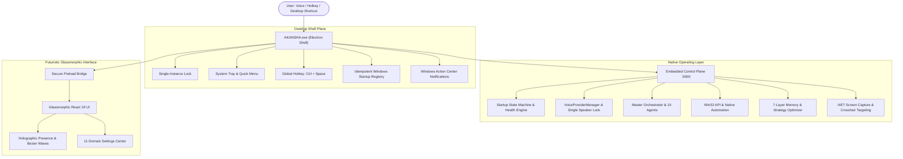

# 🌌 AKANSHA — Windows AI Operating Layer & JARVIS Desktop Assistant

<div align="center">


**A Native, Autonomous Windows AI Operating Layer & Real-Time Voice Desktop Assistant**

[](https://microsoft.com)
[](https://electronjs.org)
[](https://react.dev)
[](https://typescriptlang.org)
[](https://github.com)

</div>

---

## 📖 Overview

**AKANSHA** is a production-grade, installable Windows AI assistant and operating layer (`AKANSHA.exe`). It bridges native Win32 APIs, PowerShell automation, multi-agent DAG orchestration, vision-based computer use, 7-layer cognitive memory, real-time voice streaming with instant hardware barge-in, and an Apple-grade glassmorphic desktop interface.

Unlike web-only prototypes, **AKANSHA runs as a native Windows desktop executable** with zero localhost dependency, complete with System Tray controls, idempotent Windows startup registration, and global hotkey (`Ctrl + Space`) summoning.

---

## ⚡ Core Highlights & Capabilities



### 1. 🪟 Windows Native Control Plane
- Direct Win32 process lifecycle management (PID/HWND tracking, window focus, app launches, graceful closes).
- Native PowerShell automation bridge for administrative scripting and real system operations.
- Live hardware telemetry (CPU load, core counts, RAM utilization, active foreground window).

### 2. 🎙️ Real-Time Voice & Hardware Barge-In
- 16kHz binary PCM audio stream over WebSockets with Silero VAD.
- **Strict Single Voice Provider Lock**: Enforces exactly ONE active speaker at a time; eliminates dual speech collisions and duplicate utterances.
- **Instant Hardware Barge-In**: Silences TTS playback the millisecond user speech is detected on the microphone.
- Decoupled `VoiceRouter` supporting local models (Qwen Audio / Whisper), Web Speech, and cloud providers.

### 3. 👁️ Vision & Computer Use
- Native `.NET System.Drawing` ultra-low latency desktop screen capture (1920x1080).
- Visual coordinate targeting, automated crosshair HUD, and UI element detection.
- Visual verification loop: `OBSERVE` $\to$ `PLAN` $\to$ `ACT` $\to$ `OBSERVE` $\to$ `VERIFY`.

### 4. 🤖 15 Specialist Autonomous Agents & DAG Engine
- Supervised DAG planner running concurrent execution graphs.
- Specialist agents: *Master Orchestrator, Windows Shell Agent, Browser Specialist, Software Engineer (OpenHands), Python Interpreter, Memory Keeper, Vision Agent, Security Auditor, Hardware Controller, Social Hub Agent, Automation Worker, Strategy Optimizer, Doubt Engine, Verification Sentinel, and Device Manager*.

### 5. 🧩 Universal App & Zero-MCP Source Repo Adapter
- 10-Tier fallback resolution hierarchy (Win32 $\to$ Protocol $\to$ UI Automation $\to$ CLI $\to$ Browser $\to$ Computer Use).
- Automatic source repo scanner that reads any repository AST, discovers exported functions/APIs, and generates type-safe adapters with zero external MCP dependencies.

### 6. 🧠 7-Layer Cognitive Memory & Learning
- **Working Memory**: Live session state and active execution graph.
- **Short-Term Memory**: Conversation turns and recent context.
- **Long-Term Memory**: Persistent user facts and system state.
- **Episodic Memory**: Past mission outcomes and audit logs.
- **Semantic Memory**: Knowledge base and concept associations.
- **Procedural Memory**: Multi-step action workflows and tool chains.
- **Learned Strategy Optimizer**: Historical strategy retention with self-healing heuristics.

### 7. 🛡️ Hardened Security Vault & Delegation Guard
- AES-256 encrypted credential vault for API keys, tokens, and system secrets.
- Real-time prompt injection firewall blocking malicious shell exploits.
- Multi-tier risk gating: High-risk actions (file deletion, remote messages) require explicit human confirmation.

### 8. 🚀 Desktop Shell & Zero Localhost Exposure
- Single-instance lock: Launching a second copy brings the active window to focus.
- System Tray integration with instant status, listening triggers, and quick access.
- Global `Ctrl + Space` hotkey to summon Akansha from any application in Windows.
- Idempotent Windows login startup with time-aware polite greetings (*"Good morning. Akansha is ready. How can I help you?"*).

---

## 📂 Project Structure

```
c:\jarvis-an\
├── build/                        # App branding assets & multi-resolution icon.ico
├── dist/                         # Compiled Vite production web bundle
├── dist-electron/                # Compiled Electron main process & preload scripts
├── dist-server/                  # Compiled Node/Express Win32 backend bundle
├── electron/
│   ├── main.ts                   # Desktop lifecycle, system tray, shortcuts, startup sync
│   ├── preload.ts                # Secure contextBridge API for renderer
│   └── tsconfig.json             # TypeScript configuration for Electron
├── release/
│   ├── AKANSHA Setup 1.0.0.exe   # Single-file Windows NSIS installer
│   └── win-unpacked/             # Unpacked standalone portable application (AKANSHA.exe)
├── scripts/
│   ├── create-shortcut.ps1       # Desktop & Start Menu shortcut creator
│   └── generate-icon.js          # Multi-resolution ICO generator (16-256px BMP DIB)
├── server/
│   ├── agents/                   # 15 Specialist Agents & DAG execution planner
│   ├── apps/                     # Universal App Controller & Source Repo Scanner
│   ├── automation/               # Interval, Event, and Cron trigger engine
│   ├── core/
│   │   ├── intent/               # Intent classification, entity extraction & ambiguity doubt
│   │   ├── learning/             # Strategy optimizer & win-rate tracker
│   │   ├── orchestrator/         # Execution state machine & checkpoint engine
│   │   └── startup/              # Truthful startup state machine & health probes
│   ├── devices/                  # Native PnP hardware & audio device scanner
│   ├── memory/                   # 7-layer cognitive memory architecture
│   ├── orchestrator/             # Master orchestrator & security firewall
│   ├── security/                 # AES-256 Vault, Capability policy & audit logger
│   ├── social/                   # Unified communication inbox & draft approval
│   ├── vision/                   # .NET screen capture & computer use coordinate engine
│   ├── voice/                    # VoiceRouter, VoiceProviderManager & audio streaming
│   ├── windows/                  # Win32 Process Manager, PowerShell bridge & system metrics
│   └── index.ts                  # Embedded REST & WebSocket server
├── src/
│   ├── components/               # Glassmorphic React components for all 16 workspaces
│   │   ├── AkanshaAvatar.tsx     # Holographic avatar & presence orb
│   │   ├── CommandPalette.tsx    # Global Ctrl+Space search modal
│   │   ├── SettingsCenter.tsx    # 11-domain settings workspace
│   │   ├── VoiceCenter.tsx       # Real-time voice waveform HUD
│   │   └── WindowsControl.tsx    # Native Win32 process manager UI
│   ├── services/                 # API service & WebAudio engine
│   ├── App.tsx                   # Main desktop application shell & dock navigation
│   ├── index.css                 # Glassmorphic CSS design system
│   └── main.tsx                  # React DOM entry point
├── tests/
│   └── verify_desktop_stack.ts   # Automated verification test suite
└── package.json                  # Scripts & electron-builder packaging configuration
```

---

## 🚀 Getting Started & Installation

### Option 1: Run the Pre-Built Desktop Application (Recommended)
1. **Launch Directly**: Open [`release/win-unpacked/AKANSHA.exe`](file:///c:/jarvis-an/release/win-unpacked/AKANSHA.exe) or double-click the **`AKANSHA`** shortcut on your Desktop.
2. **Install via NSIS Installer**: Run [`release/AKANSHA Setup 1.0.0.exe`](file:///c:/jarvis-an/release/AKANSHA%20Setup%201.0.0.exe) to install Akansha to `Program Files`, create Start Menu entries, and register an uninstaller.

### Option 2: Run in Development Mode
To run the full stack (Frontend + Backend + Electron Shell) with hot module reload:
```powershell
# 1. Install dependencies
npm install

# 2. Start all services concurrently
npm run electron:dev
```

### Option 3: Build the Windows Installer & Executables
```powershell
# Build Vite frontend + compile Electron & Server TypeScript + build NSIS installer
npm run build:desktop

# Build unpacked portable directory only (release/win-unpacked/AKANSHA.exe)
npm run pack:win
```

---

## ⚙️ Settings & Customization

Open the **Settings** workspace in Akansha to configure:

1. **🚀 Windows Startup**:
   - `[ON/OFF]` Start Akansha automatically when logging into Windows.
   - `[ON/OFF]` Start minimized to System Tray.
   - `[ON/OFF]` Enable voice engine on startup.
   - `[ON/OFF]` Greet me when ready.
   - **Greeting Frequency**: `Always` | `Once per day` | `Never`.
2. **🎙️ Voice & Audio**:
   - Enforce Single Female Voice Lock.
   - Hardware Barge-In sensitivity slider (instant silence threshold).
   - Voice provider selection (Local Qwen Audio, Whisper, Web Speech).
3. **🪟 Desktop & Window Modes**:
   - Minimize-to-tray on close behavior.
   - Global activation shortcut (`Ctrl + Space`).
   - Window presets: *Assistant HUD (800x600)*, *Compact (520x720)*, *Command Center (1400x900)*.
4. **🛡️ Security & Delegation Guard**:
   - Prompt injection firewall sensitivity.
   - Destructive action approval gates.
   - AES-256 Vault auto-lock timeout.
5. **Wrench System Diagnostics**:
   - Real-time truthful health probes of all local subsystems.

---

## 🧪 Automated Subsystem Testing

Run the automated verification test suite anytime to validate the complete local stack:
```powershell
npx tsx tests/verify_desktop_stack.ts
```

Output:
```
====================================================
🔍 RUNNING AKANSHA DESKTOP AI ASSISTANT VERIFICATION
====================================================
[TEST 1] Startup State Machine: READY (5 subsystems healthy)
[TEST 2] Polite Greeting Generated: "Good morning. Akansha is ready. How can I help you?"
[TEST 3] Single Speaker Lock: Enabled | Duplicate Suppression: Verified | Barge-in: INTERRUPTED
[TEST 4] Intent Routing: Question vs Task vs Conversation verified
====================================================
✅ ALL DESKTOP SUBSYSTEM VERIFICATION TESTS PASSED
====================================================
```

---

## 📜 License & Acknowledgements

- Built for **Windows 11 Native Architecture**.
- Powered by Electron, React 19, TypeScript, Lucide Icons, and Win32 Automation APIs.
- Designed with Apple-level Glassmorphism & JARVIS Futuristic Aesthetics.
