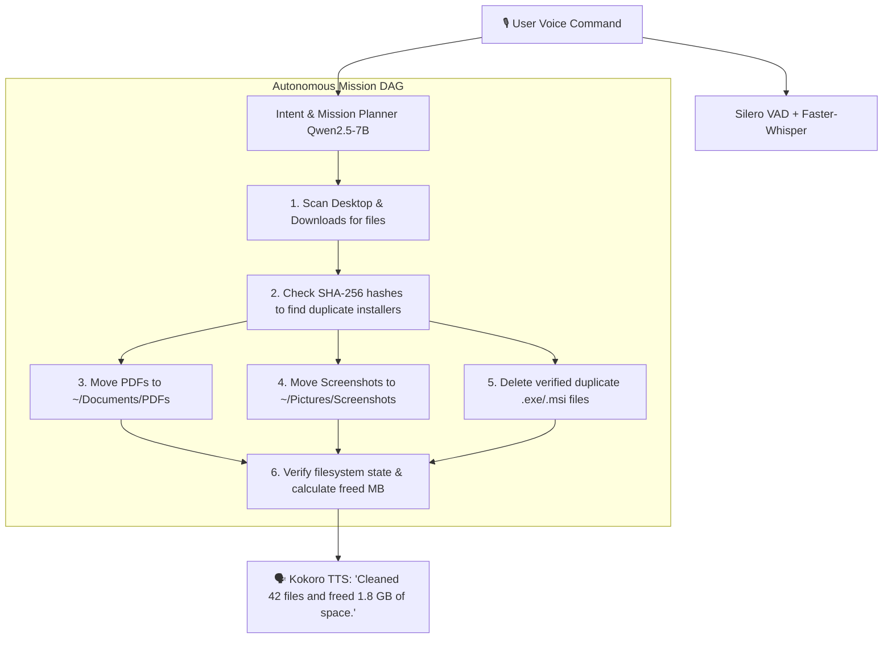
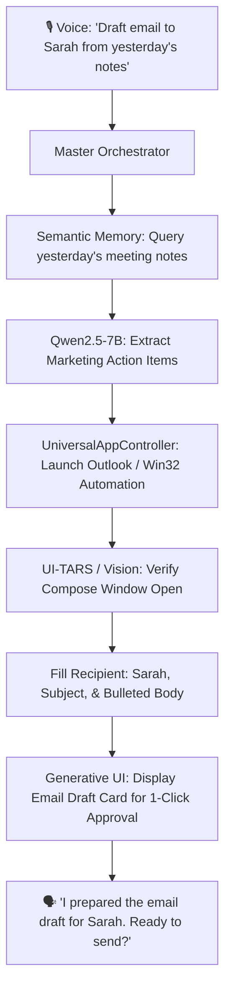
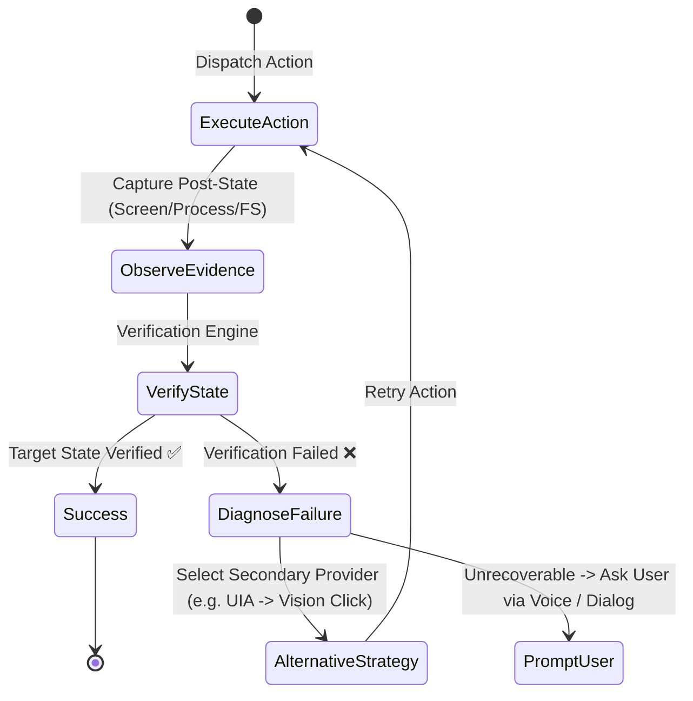

# 🧠 Deep Research & Architectural Blueprint: AKANSHA AGI Universal Operating Layer

## 🎯 Executive Vision
To turn **AKANSHA** into an omni-capable, autonomous AI Operating Layer that:
1. **Operates 100% locally on your laptop** with zero cloud API costs or privacy leaks.
2. **Executes any Windows, web, coding, document, or application task** purely through **simple, natural human voice**.
3. **Uses the absolute best open-weights models** optimized for laptop hardware (CPU + GPU / VRAM / RAM).
4. **Delivers true AGI-level task autonomy**: Plan $\rightarrow$ Execute $\rightarrow$ Observe Screen $\rightarrow$ Verify Ground Truth $\rightarrow$ Self-Heal on Failure $\rightarrow$ Learn Strategy.

---

## ⚡ 1. The Ultimate Local Model Stack for Laptops (100% Offline)

Running an entire AGI stack on a personal laptop requires a **multi-model hierarchical tier**. Instead of running one bloated 70B model that freezes your machine, AKANSHA uses specialized, high-efficiency models coordinated by the Master Orchestrator:

```
                               ┌────────────────────────────────────────────────┐
                               │           HUMAN VOICE INPUT (MIC)              │
                               └──────────────────────┬─────────────────────────┘
                                                      │
                                                      ▼
 ┌──────────────────────────────────────────────────────────────────────────────────────────────────────┐
 │ 🎙️ VOICE INGESTION LAYER                                                                             │
 │ • Voice Activity Detection (VAD): Silero VAD v5 (<5ms latency, filters noise & breathing)             │
 │ • Automatic Speech Recognition (ASR): Faster-Whisper (int8) / Moonshine (10x real-time streaming)    │
 └────────────────────────────────────────────────────┬─────────────────────────────────────────────────┘
                                                      │ (Clean Final Transcript)
                                                      ▼
 ┌──────────────────────────────────────────────────────────────────────────────────────────────────────┐
 │ 🧠 CENTRAL REASONING & ORCHESTRATION LAYER                                                          │
 │ • Primary Brain: Qwen2.5-7B-Instruct (Q4_K_M GGUF, ~4.7 GB RAM/VRAM)                                  │
 │   - State-of-the-art function calling, Windows command generation, DAG mission planning.            │
 │ • Fast Sub-Agent Router: Llama-3.2-3B-Instruct (Q4_K_M, ~1.9 GB RAM - 45+ tokens/sec)              │
 │ • Heavy Logic / Coding (Optional): Qwen2.5-Coder-14B-Instruct (Q4_K_M, ~8.8 GB RAM)                  │
 └─────────────────────────┬──────────────────────────┬──────────────────────────┬──────────────────────┘
                           │                          │                          │
                           ▼                          ▼                          ▼
 ┌───────────────────────────────┐ ┌───────────────────────────────┐ ┌──────────────────────────────────┐
 │ 👁️ VISION & COMPUTER USE      │ │ 📚 COGNITIVE MEMORY (RAG)     │ │ 🗣️ NEURAL SPEECH SYNTHESIS      │
 │ • Qwen2-VL-7B / UI-TARS-7B    │ │ • bge-small-en-v1.5 / all-Mini│ │ • Kokoro-82M (TTS)               │
 │   (Screen grounding & click)  │ │   LM-L6-v2 (Embedding ~100MB) │ │   (#1 open-weights human voice)  │
 │ • Moondream2 (1.8B Observer)  │ │ • LanceDB / SQLite-Vector     │ │ • Piper TTS (15ms ultra-low lat) │
 └───────────────────────────────┘ └───────────────────────────────┘ └──────────────────────────────────┘
```

### Model Selection & Hardware Sizing Matrix

| Capability Domain | Recommended Model | Model Size / Quant | VRAM / RAM Footprint | Inference Speed | Role in AKANSHA |
| :--- | :--- | :--- | :--- | :--- | :--- |
| **Speech-to-Text (ASR)** | **Faster-Whisper (Small/Base)** or **Moonshine** | 150M - 240M (int8) | ~250 MB RAM | ~30ms / chunk | Transcribes continuous microphone audio with zero cloud latency. |
| **Voice Activity Detection** | **Silero VAD v5** | 2MB ONNX | ~15 MB RAM | < 3ms | Detects when you start/stop speaking; enables instant barge-in. |
| **Orchestrator & Intent** | **Qwen2.5-7B-Instruct** | 7B (Q4_K_M GGUF) | ~4.7 GB VRAM/RAM | 25-35 tok/s (GPU) | Converts plain speech into multi-step executable mission DAGs. |
| **Sub-Agent Router** | **Llama-3.2-3B-Instruct** | 3B (Q4_K_M GGUF) | ~1.9 GB VRAM/RAM | 50-70 tok/s | Instant classification, conversational chit-chat, simple QA. |
| **Screen & Computer Use** | **UI-TARS-7B** or **Qwen2-VL-7B** | 7B (Q4_K_M) | ~5.2 GB VRAM/RAM | 18-25 tok/s | Sees active windows, clicks buttons, reads icons & web controls. |
| **Fast Visual Observer** | **Moondream2** | 1.8B (int4) | ~1.1 GB RAM | 35 tok/s | Real-time screen context tracking at high frame rates. |
| **Text-to-Speech (TTS)** | **Kokoro-82M** | 82M (FP16/ONNX) | ~180 MB VRAM/RAM | 200+ FPS (Realtime) | Ultra-realistic, expressive female Akansha voice. |
| **Semantic Memory** | **bge-small-en-v1.5** | 33M | ~120 MB RAM | < 5ms / query | Instant retrieval across user preferences, habits & files. |

---

## 🗣️ 2. Natural Voice Control: "Do Everything by Plain Speech"

To achieve true JARVIS-level usability, AKANSHA breaks complex, conversational instructions down into structured executions:

### Example Voice Interactions & Autonomous Execution Flow

#### Scenario A: Desktop Organization & Productivity
> **User**: *"Akansha, my desktop and downloads are a mess. Organize all PDFs into Documents/PDFs, group my screenshots into Pictures, delete any duplicate installers, and tell me how much space we freed."*



#### Scenario B: Cross-Application Workflow
> **User**: *"Open my meeting notes from yesterday, find the action items for the marketing pitch, and draft an email to Sarah with those points in Outlook."*



---

## 🪟 3. The 4-Tier Universal Actuation Engine

AKANSHA operates any software on Windows without requiring developers to write custom plugins:

```
Level 1: Native Win32 & PowerShell APIs (Sub-millisecond direct OS control)
         ├── Process management, window handles (HWND), registry, filesystem, system settings.
         
Level 2: Windows UI Automation (UIA) & Accessibility Tree
         ├── Direct programmatic inspection of buttons, textboxes, menus, and tabs in any app.
         
Level 3: Deep Browser Control (Playwright / Browser-Use)
         ├── DOM navigation, cookie sessions, form filling, scraping, web research.
         
Level 4: Visual Computer Use (UI-TARS / Qwen2-VL Grounding)
         ├── For legacy or custom apps without accessibility APIs: takes screenshot, detects (X, Y)
             coordinates of visual elements, and dispatches native mouse/keyboard events.
```

---

## 🛡️ 4. Autonomous Verification & Self-Healing ("No Fake Success")

When performing real work, AI cannot assume that sending a keystroke guarantees task completion. AKANSHA uses an **Observe $\rightarrow$ Act $\rightarrow$ Verify $\rightarrow$ Recover** loop:



---

## 🚀 5. Action Plan & Next Architectural Implementation Steps

To bring 100% offline local model execution to AKANSHA on your laptop:

1. **Integrated Ollama / llama.cpp Native Runner**:
   - Add automated local model detection (`http://localhost:11434` or embedded `llama-server.exe`).
   - Automatically download and configure `qwen2.5:7b-instruct-q4_K_M` and `llama3.2:3b`.

2. **Kokoro-82M & Faster-Whisper Local Voice Pipeline**:
   - Embed lightweight ONNX/C++ runtimes for `Kokoro-82M` (speech output) and `Faster-Whisper` (speech input).
   - Zero internet requirement for conversation and command execution.

3. **Dynamic Multi-Step Mission DAG Engine**:
   - Deconstruct complex single voice instructions into multi-agent workflows with real-time HUD visualization.

4. **Continuous Learning & Strategy Optimization**:
   - Remember what shortcuts, file locations, and application habits you use, progressively getting faster with each session.
